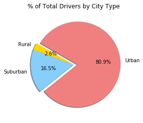

# Ride Sharing Company's Recordset of Rides

### What This Is:

An analysis of rides from a ridesharing company using the Pandas and Matplotlib libraries. The data file includes information about every active driver and historic ride, including details like city, driver count, individual fares, and city type.

### Files:
* [City Data](citi_data.csv)
* [Ride Data](ride_data.csv)

### Scatter Plot that Examines the Relationship between Four Variables

* Average Fare ($) Per City
* Total Number of Rides Per City
* Total Number of Drivers Per City
* City Type (Urban, Suburban, Rural)

### Pie Charts For:

* % of Total Fares by City Type

* % of Total Rides by City Type

* % of Total Drivers by City Type

